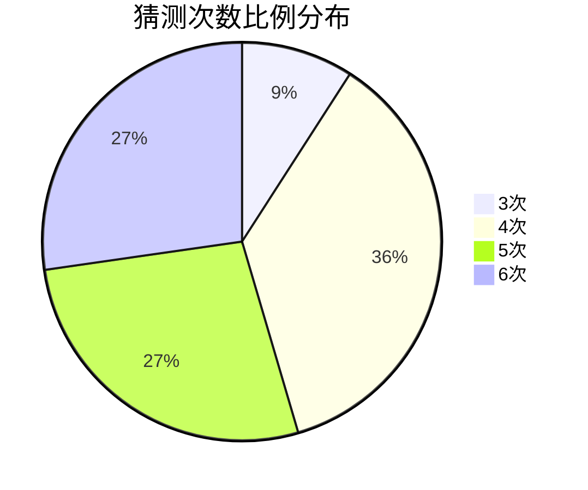
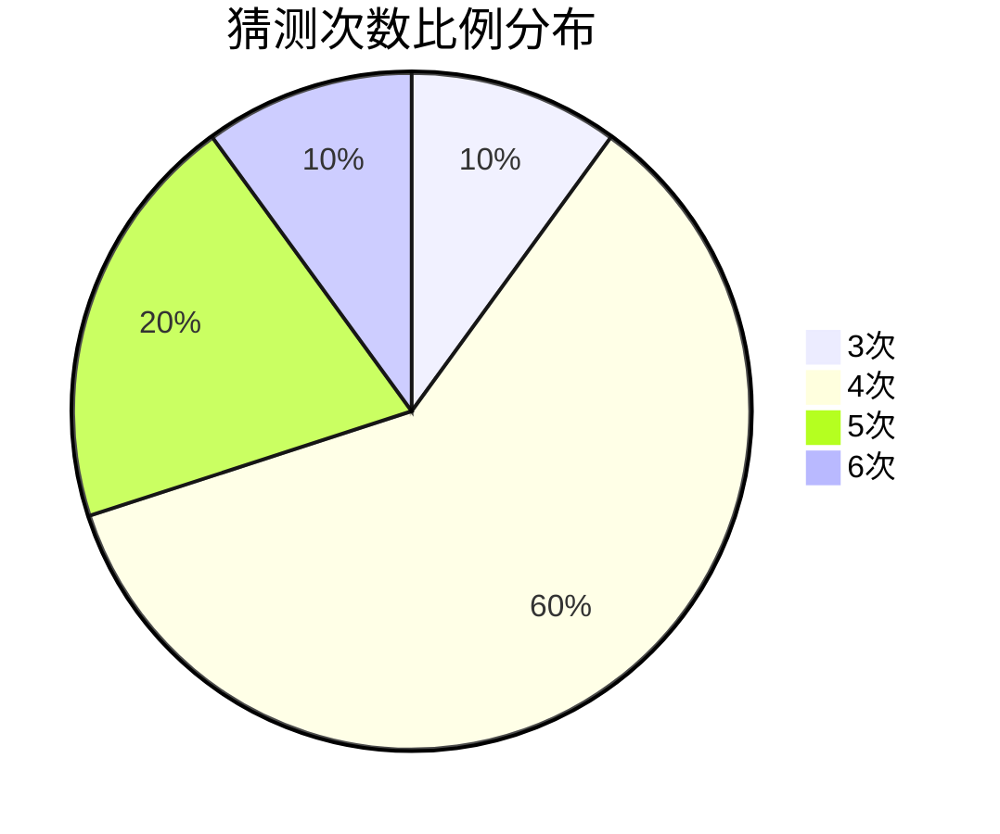

# Wordle-Game-Robot-Cpp

This is a wordle robot that can play wordle with code! It is based on entropy, so its validity is proved. Remember that if the letter is correct, type G; if the letter is in the wrong place, type Y; else, type N. You may not directly use this code in wordly.org, because when the correct answer is abcde(example used) and your answer is aecef, then wordly will show GNGNN, but you should type GYGYN because the two "e"s are all in the wrong place. Enjoy using it!(Tips: you can run it directly on your compiler.)

Here is the report that shows how this code is made. If you are interested in this, enjoy it!

The report is in Chinese, if you have some problems with it, it is fair to use a translator.

# 跨学科研究性学习：探究 $\text{wordle}$ 猜词游戏的奥秘

## 引入

为了增强自己的英语词汇量，我找到了一款游戏 $\text{wordle}$。这款游戏旨在通过趣味猜词的方式，让我们增加词汇量，不失为一种简单高效的方法。

但是由于游戏有一定难度，所以我经常无法再规定次数内猜出正确的单词。这让我非常苦恼。

于是，我便提出问题：$\text{wordle}$ 游戏是否存在必胜策略？如何进行猜测才能最小化期望的猜测次数？

## 探究价值

本次探究不仅可以找到猜词游戏更优的策略，还可以加深我们对信息论这方面的理解。信息论是信息学中必不可少的一环，重要的概念——信息熵是信息量的量化表达。这次探究可以让我们理解并运用信息熵。

## $\text{wordle}$ 游戏的规则

在探究这个游戏之前，我们要先明确游戏的规则。

经过信息搜索，我得出 $\text{wordle}$ 游戏的规则如下：

> $\text{Wordle}$ 是前段时间在国外一个非常火的猜词游戏，玩家一共有六次机会来猜测一个由五个字母组成的单词。每进行一次猜词，都会根据猜测的单词和正确答案的匹配程度给予一些提示。对于每一个字母可能出现的提示有三种：灰色、黄色、绿色。灰色表示当前这个字母没有出现在最终答案之中；黄色表示当前字母出现在最终答案之中但是位置不对；绿色则表示当前字母出现在最终答案之中同时位置也是正确的。例如：最终答案是「$\texttt{snail}$」，猜测单词「$\texttt{sneak}$」，那么因为 `s` 和 `n` 都和答案的字母且位置相同，那么就会变成绿色，`a` 出现在答案之中，但位置不正确就会呈现黄色，`e` 和 `k` 因为没有出现在答案中就会变成灰色。最后呈现的结果即为 $\text{\textcolor{green}{sn}\textcolor{gray}{e}\textcolor{red}{a}\textcolor{gray}{k}}$。因为黄色显示的不清楚，所以就替换成了红色。$\text{Wordle}$ 游戏就是通过一次次的猜测后利用提示来缩小范围从而找到最终的答案。

## $\text{wordle}$ 游戏传统思维

首先，我先探索了一个相对比较优秀的猜词策略。

显然，英语中的辅音有 $21$ 个，分别是 $\text{bcdfghjklmnpqrstvwxyz}$，而元音只有 $5$ 个，分别是 $\text{aeiou}$。

所以从元音入手显然是一个比较理想的策略。

经过大量的搜索和尝试，我发现了 $\text{aisle}$ 和 $\text{youth}$ 的单词组合。这两个单词可以直接尝试 $a,e,i,o,u$ 五个元音，而且还可以尝试出一些非常常见的辅音例如 $s,l,t,h,y$。

在使用了这个技巧后，我基本就可以在 $5$ 次操作之内猜出合法的单词了，但是操作次数仍有一些波动。

我利用所学信息技术知识，写了一段代码，使用这个策略进行游戏。猜完前两个单词之后后面的单词进行随机猜测，并根据猜测的结果排除掉错误的结果。

程序访问了一个文件 `scramble.txt`，即为下载的词库。

部分核心代码如下。

```cpp
bool check(string word)
{
	string none, not_corr;
	for (int i = 0; i < word.size(); i ++ )
		if (res[i] == 'G' && word[i] != s[i]) return false;
	
	for (int i = 0; i < word.size(); i ++ )
	{
		if (res[i] == 'G') continue;
		if (res[i] == 'Y' && word[i] == s[i]) return false;
		if (res[i] == 'N' && word[i] == s[i]) return false;
		if (res[i] == 'Y') not_corr += s[i];
		else none += s[i];
	}
	string rest = "";
	for (int i = 0; i < word.size(); i ++ )
		if (res[i] == 'G');
		else rest.push_back(word[i]);//cout<<"ok: " << word<<" "<<not_corr<<" "<<none<<" "<<rest<<endl;
	for (auto i : not_corr) 
		if (rest.find(i) == rest.npos) return false;
	for (auto i : none)
		if (rest.find(i) != rest.npos) return false;
	return true;
}

void rebuild()
{
	vector<string> tmp;
	for (int i = 0; i < words.size(); i ++ )
		if (check(words[i])) tmp.push_back(words[i]);
	words.clear();
	for (auto i : tmp) words.push_back(i);
}

void guess(int op)
{
	if (op == 1) s = "aisle";
	else if (op == 2) s = "youth";
	else s = words[rand() % (int)words.size()];
	cout << "Guess: " << s << "\n";
	cout << "Please input the result of this guess. " << "\n";
	cin >> res;
	if (res == "GGGGG")	
	{
		cout << "Yeah! I win!\n";
		exit(0);
	}
	rebuild();
} 
```

经过一定次数的游戏，得到了以下猜测次数的结果。

| 猜测次数 | 比例   |
| -------- | ------ |
| $1$      | $0\%$  |
| $2$      | $0\%$  |
| $3$      | $9\%$  |
| $4$      | $36\%$ |
| $5$      | $27\%$ |
| $6$      | $27\%$ |



## $\text{wordle}$ 游戏的数学策略

现在，我们的程序已经基本能在规定的次数内猜出给定的单词了。

但是，我仍然在考虑一个问题：如何让这个程序做的更优？如何进一步缩减程序的猜测次数？

显然，如果要想尽快猜到正确答案的话，我们需要尽可能让我们的猜测缩小的范围尽可能多。

我们可以将缩小范围这一过程视为 **有关单词信息的获取**，尽量从 **每一次猜测中获得最多的信息**。

那么，如何用一个具体的数来 **量化** 信息量呢？

通过 $\text{wordle}$ 网站中的介绍，我得知了单词总列表的大小为 $12972$ 个，都可以作为猜测词进行使用；而有一个 $2315$ 个单词的列表可能作为答案，可能是因为其他单词过于生僻的原因。

这个时候，我们就可以引入信息熵的概念，英语中为 $\text{Entropy}$。

信息熵的单位是比特。信息量和信息熵的数量相等、意义相反，相当于衡量一则信息能消除多少不确定性。具体来说，我使用了抛硬币的方式进行理解。

> 扔 $1$ 枚硬币只会出现正、反两种结果，而且概率相等。
>
> 扔 $2$ 枚硬币就有正正、正反、反正、反反这 $4$ 种结果，扔 $n$ 次有 $2^n$ 种结果。
>
> 当一个事件有两种结果且概率都是 $\frac{1}{2}$，其不确定性相当于**扔 $1$ 枚硬币**，此时信息熵定义为 $1$ 比特。
>
> 如果一个事件有 $8$ 种结果且概率都是 $\frac{1}{8}$，就相当于**扔 $3$ 枚硬币**，此时信息熵就是 $3$ 比特。

设每种结果的概率为 $p$，信息量为 $I$，则有 $\displaystyle(\frac{1}{2})^I=p$。

通过与数学老师进行讨论，我推导出了 $I$ 的公式：$I=-\log_2(p)$。

对于一个信息 $I$，我们可以用一个公式计算出他对应的信息熵：$\displaystyle E[I]=\sum_x p(x) \cdot \log _2(\frac{1}{p(x)})$。

由于计算机的运行速度非常之快，一秒可以进行 $5\times 10^8$ 次左右的加法操作，使用更高性能的电脑甚至可以更快，所以我们可以于限定的时间内计算出所有单词的信息熵。

当然这只是第一步，我们可以进一步的用同样的方法，可以再计算第二步、第三步猜测能消除的信息熵。注意我们猜词之后，仍然可以使用之前程序中展示的那种方法，排除不合法的单词后重新计算信息熵。

我再一次实现了这个思路的代码。为了提高代码准确率，我人为添加了最佳开局 $\text{crane}$。

其中 `SCRAMBLE` 为词库，中间没有空格隔开。

```
typedef long long ll;
vector<string> rem, rem2, trem, irem;
const char *bstInitial[26] = {"slier", "lares", "lares", "tores", "tarns", "arles", "lares", "lares", "snare", "ousel", "ranis", "nares", "tares", "aides", "tries", "lares", "raise", "aides", "plate", "nares", "snare", "riles", "nares", "cones", "kanes", "aeons"};

int cnt[245], gold[5], silver[5], buc[30];
double Entropy(string guess) 
{
	double ret = 0; memset(cnt, 0, sizeof(cnt));
	for (int i = 0; i < rem.size(); i ++ ) 
	{
		for (int j = 0; j < 5; j ++ ) gold[j] = silver[j] = 0;
		for (int j = 0; j < 5; j ++ ) gold[j] = (rem[i][j] == guess[j]);
		for (int j = 0; j < 5; j ++ )
			if (!gold[j])
				for (int k = 0; k < 5; k ++ )
					if (j != k && !gold[k])
						silver[j] |= (guess[j] == rem[i][k]);
		int S = 0;
		for (int j = 0, bs = 1; j < 5; j ++, bs *= 3) 
		{
			if (gold[j]) S += 2 * bs;
			else if (silver[j]) S += 1 * bs;
		}
		cnt[S] ++;
	}
	for (int S = 0; S < 243; S ++ ) 
	{
		if (!cnt[S]) continue;
		double P = (double)cnt[S] / rem.size();
		ret = ret - P * log2(P);
	}
	return ret;
}

void init(int num_scramble, const char *scramble) 
{
	for (int i = 0; i < num_scramble; i ++ ) 
	{
		string tmps; tmps.resize(5);
		for (int j = 0; j < 5; j ++ ) tmps[j] = scramble[i * 5 + j];
		rem.push_back(tmps);
	}
}

string lstGuess;
const char *guess(int num_testcase, int remaining_guesses, bool *gold, bool *silver) 
{
	if (remaining_guesses == 5) 
	{
		lstGuess = "crane";
		return lstGuess.c_str();
	} 
	else 
	{
		for (int i = 0; i < rem.size(); i ++ ) 
		{
			int flg = 1;
			for (int j = 0; j < 5; j ++ ) 
				if (gold[j] && rem[i][j] != lstGuess[j])
					flg = 0;
			for (int j = 0; j < 5; j ++ ) 
				if (silver[j] && rem[i][j] == lstGuess[j])
					flg = 0;
			for (int j = 0; j < 5; j ++ )
				if (silver[j]) 
				{
					int flg2 = 0;
					for (int k = 0; k < 5; k ++ ) 
						if (!gold[k] && lstGuess[j] == rem[i][k]) flg2 = 1;
					flg &= flg2;
				}
			for (int j = 0; j < 5; j ++ )
				if (!gold[j] && !silver[j])
					for (int k = 0; k < 5; k ++ ) 
						if (!gold[k] && rem[i][k] == lstGuess[j])
							flg = 0;
			if (flg) trem.push_back(rem[i]);
		}
		swap(rem, trem); 
		trem.clear();
		double mx = -1;
		string bstGuess;
		for (int i = 0; i < rem.size(); i ++ ) 
		{
			double tmp = Entropy(rem[i]);
			if (tmp > mx) mx = tmp, bstGuess = rem[i];
		}
		mx = mx + 2 * tanh(1 / log2(rem.size()));
		lstGuess = bstGuess;
		return lstGuess.c_str();
	}
}

int main() 
{
	init(NUM_SCRAMBLE, SCRAMBLE);
	char buf[10];
	bool gold[5], silver[5];
	const char *guess_word = guess(1, 5, gold, silver);
	printf("%s\n", guess_word);
	for (int j = 4; j >= 0; j -- ) 
	{
		scanf("%s", buf); 
		if (buf[0] == 'G' && buf[1] == 'G' && buf[2] == 'G' && buf[3] == 'G' && buf[4] == 'G')
		{
			printf("I win!\n");
			break;
		}
		for (int k = 0; k < 5; k ++ ) 
		{
			gold[k] = buf[k] == 'G';
			silver[k] = buf[k] == 'Y';
		}
		guess_word = guess(1, j, gold, silver);
		printf("%s\n", guess_word);
	}
	return 0;
}

```

实验结果如下：


| 猜测次数 | 比例   |
| -------- | ------ |
| $1$      | $0\%$  |
| $2$      | $0\%$  |
| $3$      | $10\%$ |
| $4$      | $60\%$ |
| $5$      | $20\%$ |
| $6$      | $10\%$ |



经过实测，此代码基本不会在 $5$ 次以外才能猜出答案，效率得到了显著提高。

## 前后两种策略对比

| 猜测次数 | 传统策略比例 | 数学策略比例 |
| -------- | ------------ | ------------ |
| $1$      | $0\%$        | $0\%$        |
| $2$      | $0\%$        | $0\%$        |
| $3$      | $9\%$        | $10\%$       |
| $4$      | $36\%$       | $60\%$       |
| $5$      | $27\%$       | $20\%$       |
| $6$      | $27\%$       | $10\%$       |

从数据对比来看，优化策略显著降低了猜测次数，尤其是四次以内猜中的概率大幅提高。

## 总结与思考

在这次跨学科实践的学习活动中，我运用了各种不同的学科知识进行解决，如数学、英语、科学、信息等各方面。

这次学习活动不禁让我增强了对 $\text{wordle}$ 游戏方法的探索，更让我巩固并完善了数学、英语、科学、信息等各方面的知识，增强了我的跨学科学习能力。

当然，这次活动还可以引申出更多的问题：$\text{wordle}$ 游戏是否可以使用答案词库只有 $2315$ 个词这一特性，进一步优化猜测的次数？或者，能否使用类似的方式解决 $\text{wordle}$ 游戏的引申版本——$\text{quordle}$？

以上问题等待着我和更多同学进行探索。书山有路勤为径，学海无涯苦作舟，希望以后的探索学习能有更大的收获！
